# Attack Observation 2: Automated Telnet Malware Loader Attempt

## Report metadata

| Field | Value |
|---|---|
| Observation date | 28 May 2026 |
| Observed source | `31.56.209.72` |
| Honeypot | DShield Cowrie (`192.168.50.200`) |
| Initial service | Telnet TCP/23 (Cowrie TCP/2223) |
| Accepted credential | `telecomadmin / admintelecom` |
| First-stage loader | `hxxp://31[.]56[.]209[.]72/cat.sh` |
| Session duration | Approximately three minutes |
| Final assessment | Automated Linux/IoT malware-loader attempt consistent with botnet-style mass loading; specific family and successful enrollment were not confirmed. |

> **Public-repository note:** The original report included a public/NAT address belonging to the sensor environment. It is intentionally omitted from this Markdown version.

## 1. Executive Summary and Scope

At approximately 22:34 UTC, the Cowrie honeypot accepted a Telnet login from `31.56.209.72` using `telecomadmin / admintelecom`. The session tested writable directories, attempted process cleanup, retrieved `cat.sh`, attempted downloads for multiple Linux CPU architectures, queried CPU information, and began reconstructing an ARM ELF file through repeated hexadecimal writes.

The event was correlated across the DShield portal, Cowrie TTY replay, a cleartext Telnet PCAP, Security Onion endpoint telemetry, Zeek connection/HTTP/file logs, Suricata, NetFlow, and locally preserved Cowrie artifacts.

| Metric | Observed value |
|---|---:|
| HTTP retrieval flows | 2 |
| Confirmed loader size | 1,845 bytes |
| Targeted architectures | 14 |
| Preserved artifacts | 3 |

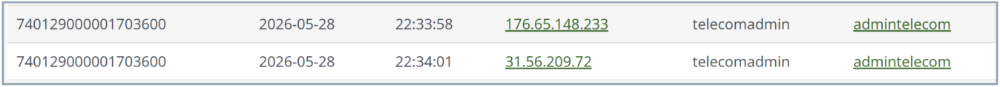

*Evidence 1 / Figure 1 - DShield login record*

## Attack Selection and Targeted Exposure

This session was selected because it produced the largest Cowrie TTY replay file in the review period. The unusually large file led to a complete sequence of Telnet authentication, writable-directory discovery, process-cleanup logic, loader retrieval, multi-architecture deployment attempts, CPU discovery, and fallback ARM ELF reconstruction.

No software exploit or CVE was identified. The initial access method was credential-based abuse of an Internet-facing Telnet service. Telnet also exposed the accepted username, password, and commands in cleartext.

## Attacker Objective

1. Authenticate to Telnet and obtain a shell.
2. Find writable locations and remove files or processes that could interfere.
3. Retrieve `cat.sh` from the external source.
4. Download and execute binaries for 14 Linux CPU architectures.
5. Reconstruct `iran.armv5l` from hexadecimal chunks when ordinary retrieval did not complete.

The observed sequence supports an automated Linux/IoT loader workflow. It does **not** confirm final payload behavior, command-and-control enrollment, persistence, DDoS activity, or a specific malware family.

## Defensive Measures

| Priority | Control | Purpose |
|---|---|---|
| 1 | Disable Telnet and use SSH/HTTPS only where remote management is required. | Removes the cleartext service used for access. |
| 2 | Replace default or vendor-style credentials; use unique passwords or public-key authentication. | Prevents simple credential reuse or guessing. |
| 3 | Restrict management to VPN, allowlisted IPs, or a dedicated management network. | Removes the service from broad Internet scanning. |
| 4 | Restrict unnecessary outbound HTTP and monitor Wget/Curl connections to raw IP addresses. | Disrupts loader and payload retrieval. |
| 5 | Correlate login, writable-path tests, process killing, HTTP download, and ELF creation. | Detects the complete access-to-execution sequence. |

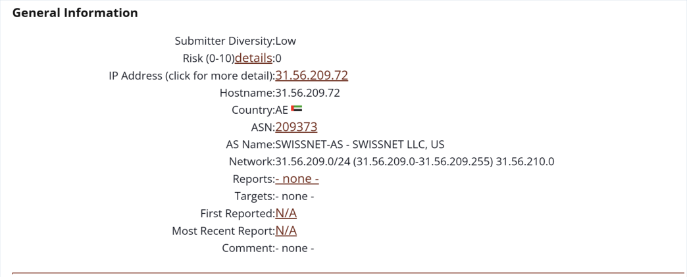

*Evidence 2 / Supplementary Figure A - DShield IP context*

## 2. Correlated Timeline

| UTC | Telemetry | Observed event |
|---|---|---|
| 22:33:58.875 | Endpoint | Cowrie accepted `31.56.209.72:39744 -> 192.168.50.200:2223`. |
| 22:34:00.097 | Zeek conn | Network-facing Telnet flow observed to TCP/23. |
| 22:34:01 | DShield | Login recorded with `telecomadmin / admintelecom`. |
| 22:34:08.728 | Endpoint | Outbound connection attempt to `31.56.209.72:80`. |
| 22:34:10.051 | Zeek conn | First HTTP flow from the honeypot to the source IP. |
| 22:34:10.151 | Zeek HTTP | `GET /cat.sh` via `Wget/1.11.4`; `200 OK`; 1,845 bytes. |
| 22:34:10.250 | Zeek file | Complete shell-script transfer; zero missing bytes; hashes recorded. |
| 22:34:10.258 | Zeek conn | Second HTTP flow for the same loader. |
| 22:34:10.470 | Suricata / Zeek file | Suricata alerted on the transfer and Zeek recorded matching file hashes. |
| 22:37:00.448 | Endpoint | Cowrie recorded `disconnect_received`. |

## 3. Initial Access - Cleartext Telnet Session

The PCAP showed the username, password, shell prompt, and early commands in cleartext. This confirmed credential-based access rather than a pre-authentication exploit.

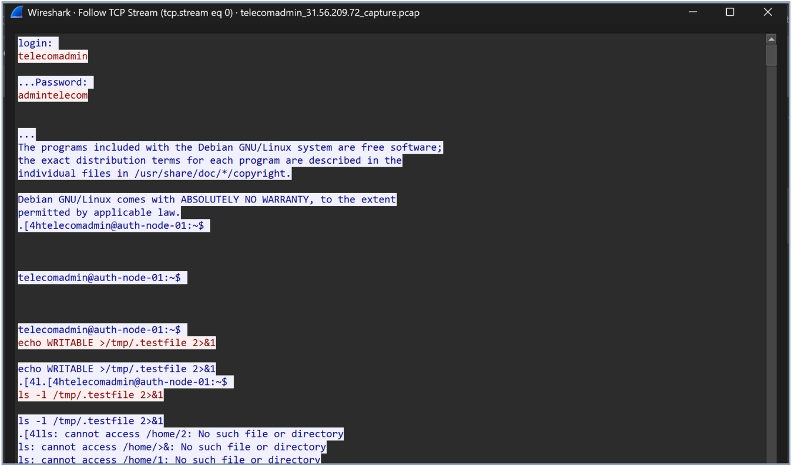

*Evidence 3 / Figure 2 - Wireshark Telnet stream*

## 4. Security Onion Session Correlation

Security Onion connected the Telnet activity to endpoint, Zeek, and NetFlow records. The same source, ports, timestamps, and flow identifiers were used to reconstruct the session.

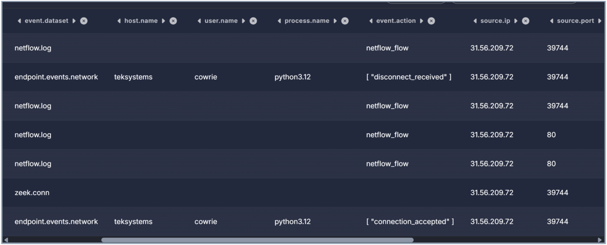

*Evidence 4 / Figure 3 - Security Onion correlation*

## 5. NetFlow and NAT Correlation

NetFlow corroborated the Telnet and HTTP paths. Flow-export timestamps were treated as supporting metadata because they may represent flow end, aggregation, or export time rather than the first packet.

## 6. Writable-Directory Discovery

The attacker tested `/tmp`, `/var/tmp`, `/dev/shm`, and `/var/run` to locate a usable staging path. Cowrie preserved the `WRITABLE` artifact created during these tests.

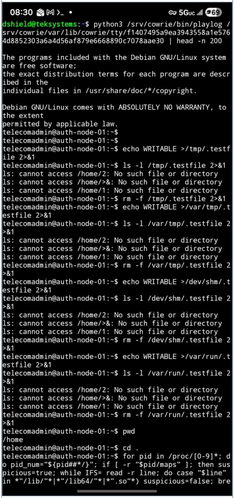

*Evidence 5 / Figure 4 - Writable-directory tests*

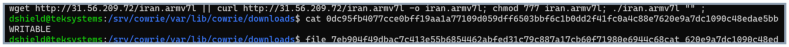

*Evidence 6 / Figure 5 - WRITABLE artifact inspection*

## 7. Process Cleanup and Loader Command

The session inspected `/proc`, attempted `kill -9` operations, and issued the loader command. Cowrie emulation produced some shell errors, but the intended process-cleanup behavior was clear.

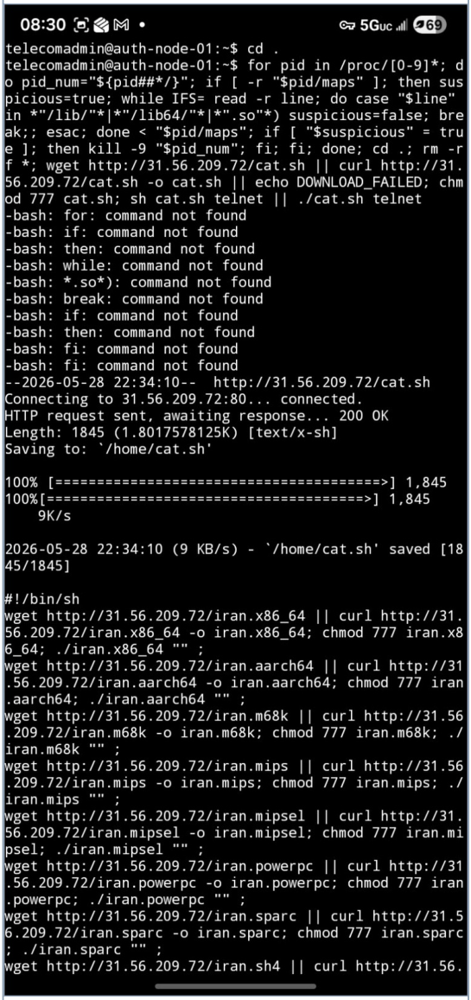

*Evidence 7 / Figure 6 - Process inspection and kill logic*

## 8. Confirmed HTTP Loader Retrieval

The loader was retrieved through two HTTP transactions. Zeek recorded a complete 1,845-byte shell script with no missing bytes; local hashes matched the network-observed file.

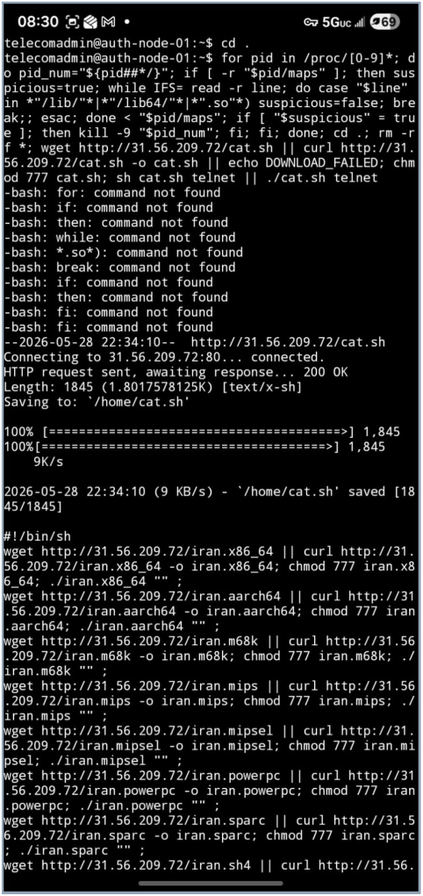

*Evidence 8 / Figure 7 - cat.sh retrieval*

## 9. Multi-Architecture Loader Analysis

The recovered shell script attempted to download and execute payloads for 14 Linux CPU architectures. This broad architecture coverage is consistent with mass-loading activity targeting routers, cameras, DVRs, and other embedded Linux systems.

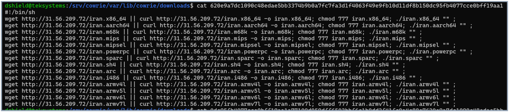

*Evidence 9 / Figure 8 - cat.sh loader contents*

## 10. CPU Discovery and Fallback Behavior

The attacker queried `/proc/cpuinfo`. When ordinary retrieval did not complete, the session began reconstructing an ARM executable from hexadecimal chunks.

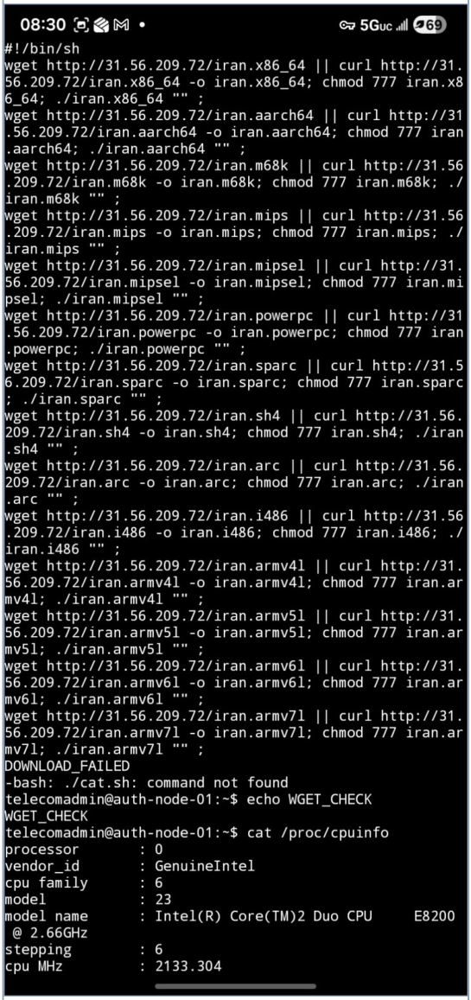

*Evidence 10 / Figure 9 - CPU discovery and fallback sequence*

## 11. Cowrie Artifact Inventory

Cowrie preserved three artifacts: the writable-path test artifact, the first-stage loader, and a partial ARM ELF object.

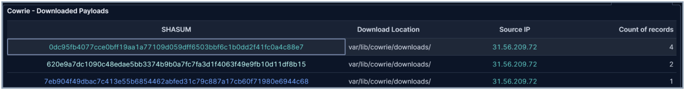

*Evidence 11 / Figure 10 - Cowrie artifact inventory*

## 12. Local Artifact Validation

Static inspection confirmed the shell loader and the non-malware writable test artifact. The third object was identified as an ARM ELF, but it was incomplete.

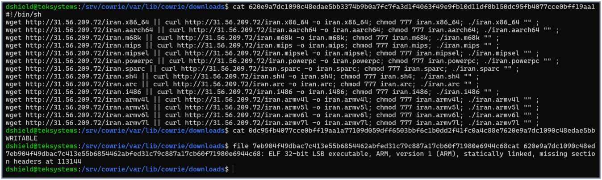

*Evidence 12 / Figure 11 - Local artifact validation*

## 13. ARM ELF Reconstruction Evidence

Repeated hexadecimal writes reconstructed a 37,728-byte partial ARM object. The file began with valid ELF magic and architecture metadata.

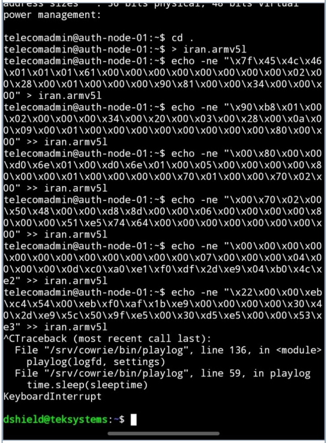

*Evidence 13 / Figure 12 - ARM ELF reconstruction*

## 14. ELF Static Analysis and Truncation

The `file` utility identified a 32-bit ARM ELF with missing section headers. The missing program content prevented complete static or dynamic analysis, so final payload behavior could not be established.

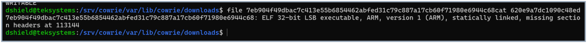

*Evidence 14 / Figure 13 - ARM ELF identification*

## 15. Attack Chain and MITRE ATT&CK Mapping

| Stage | Observed activity | Outcome |
|---|---|---|
| Initial access | Telnet login using `telecomadmin / admintelecom`. | Confirmed simulated access. |
| Staging discovery | Writable-path tests under common temporary directories. | Confirmed; test artifact preserved. |
| Process cleanup | `/proc` inspection and `kill -9` logic. | Attempted. |
| Ingress transfer | Two HTTP flows retrieving `/cat.sh`. | Confirmed complete 1,845-byte file. |
| Payload deployment | Download/execute attempts for 14 architectures. | Intent confirmed; final execution not observed. |
| System discovery | `cat /proc/cpuinfo`. | Command observed. |
| Fallback transfer | Hexadecimal reconstruction of `iran.armv5l`. | Partial ARM ELF captured. |

| Technique | ID | Basis |
|---|---|---|
| Valid Accounts | T1078 | Accepted credential pair in the simulated Telnet service. |
| Unix Shell | T1059.004 | Chained shell commands and script execution. |
| Ingress Tool Transfer | T1105 | Confirmed loader transfer and payload attempts. |
| Web Protocols | T1071.001 | HTTP used for loader and payload transport. |
| System Information Discovery | T1082 | `/proc/cpuinfo` query. |
| File and Directory Discovery | T1083 | Writable-path testing and staged file operations. |

## 16. Indicators and Detection Opportunities

- Alert on Telnet authentication followed by outbound HTTP.
- Detect Wget/Curl to raw IPv4 addresses from IoT or embedded systems.
- Detect architecture-name bursts and ELF reconstruction through hex writes.
- Monitor executable creation in `/tmp`, `/var/tmp`, `/dev/shm`, and `/var/run`.
- Preserve and correlate Cowrie session IDs, Zeek UIDs, Community IDs, and artifact hashes.

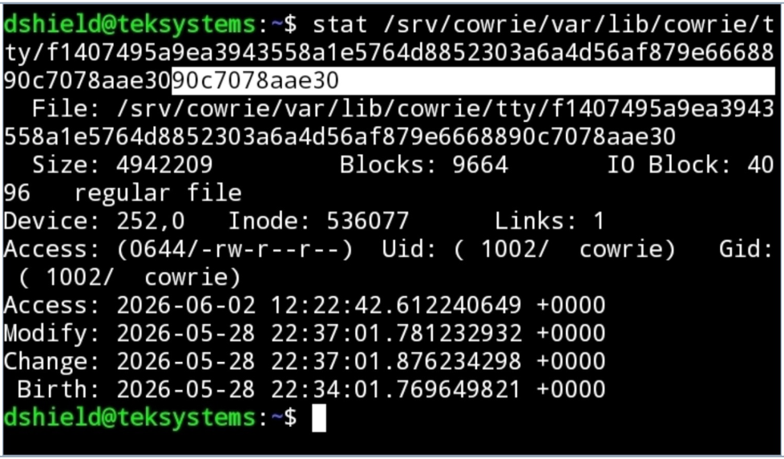

*Evidence 15 / Figure 14 - TTY metadata*

## 17. Assessment, Limitations, and Conclusion

The observation represents a well-correlated automated Telnet malware-loader attempt. The evidence confirms the login, loader retrieval, multi-architecture deployment intent, and partial ARM reconstruction. It does not confirm full payload execution, persistence, command-and-control exchange, DDoS activity, botnet enrollment, actor attribution, or a specific malware family.

### Selected references

1. Antonakakis et al., *Understanding the Mirai Botnet*, USENIX Security 2017.
2. Zhu et al., *Devils in the Clouds: An Evolutionary Study of Telnet Bot Loaders*.
3. Trend Micro, *Worm War: The Botnet Battle for IoT Territory*.
4. MITRE ATT&CK technique pages for T1059.004, T1071.001, T1078, T1082, T1083, and T1105.
