# Attack Observation 3: Multi-Architecture SOCKS5 Proxy Deployment Attempt

## Report metadata

| Field | Value |
|---|---|
| Observation date | 20 July 2026 |
| Observed source | `45.134.12.117` |
| Honeypot | DShield Cowrie (`192.168.50.200`) |
| Initial service | SSH / Cowrie |
| Accepted credential | `admin / admin` |
| Staging path | `/tmp/s.b64 -> /tmp/s` |
| Proxy port | TCP/44848 |
| Embedded proxy credential | `root1234 / toor1234` |
| Final assessment | Attempted deployment of Python and native multi-architecture SOCKS5 proxy implementations; a working listener was not confirmed. |

## 1. Executive Summary and Scope

The investigation began by sorting the Cowrie TTY directory by size and replaying the largest recording. The session contained long `echo` commands that appended Base64 data to `/tmp/s.b64`. Searching the TTY hash in Security Onion exposed session `6954b3a0f2ec` and source `45.134.12.117`.

The source completed six successful `admin / admin` logins within approximately three minutes. Four ASCII artifacts decoded into ELF executables for x86-64, MIPS big-endian, MIPS little-endian, and ARM. Static analysis found explicit SOCKS5 strings, proxy credentials, and listener/relay functions. A separate session wrote a Python SOCKS5 server using the same port and credentials.

| Metric | Observed value |
|---|---:|
| Cowrie records for the source | 8,411 |
| Successful logins | 6 |
| Decoded CPU architectures | 4 |
| Attempted listener | TCP/44848 |

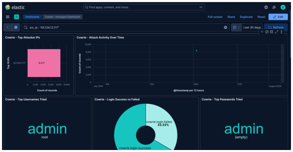

*Evidence 1 / Figure 1 - Cowrie source dashboard*


## Attack Selection and Targeted Exposure

The largest TTY file was 32,400,331 bytes and contained repeated encoded data. The investigation revealed six sessions, four complete architecture-specific ELF payloads, and a separate Python proxy implementation.

No product-specific software exploit or CVE was observed. Cowrie recorded six successful SSH logins using the weak/default-style credential `admin / admin`.

## Attacker Objective

1. Authenticate as `admin`.
2. Stage Python source or Base64-encoded native payloads.
3. Decode native ELF files to `/tmp/s`.
4. Submit detached launch commands for TCP/44848.
5. Use the compromised device as a SOCKS5 traffic intermediary.

A SOCKS proxy would accept a client connection, open a second connection to a client-selected destination, and relay bytes between both sockets. On a real victim, later traffic could appear to originate from the victim's IP address.

## Defensive Measures

| Priority | Control | Purpose |
|---|---|---|
| 1 | Restrict SSH to VPN or allowlisted management networks. | Reduces Internet scanning and credential attacks. |
| 2 | Use unique passwords, SSH keys, MFA, and disable direct administrative password login. | Prevents `admin/admin`-style access. |
| 3 | Detect long Base64 shell input, repeated `echo >> /tmp/*.b64`, `base64 -d`, `chmod +x`, and `setsid`. | Interrupts inline payload reconstruction. |
| 4 | Monitor or restrict execution from `/tmp`, `/var/tmp`, and `/dev/shm`. | Limits temporary-directory execution. |
| 5 | Alert on unauthorized listeners and processes that both accept and create connections. | Identifies traffic-relay behavior. |
| 6 | Segment devices and apply outbound filtering. | Limits relay abuse and internal access. |

## 2. Correlated Timeline

| UTC | Telemetry | Observed event |
|---|---|---|
| 18:04:42.954 | Cowrie login | `admin / admin` succeeded; session `71e632febe1e`. |
| 18:04:48.168 | Cowrie login | Session `c3f420d74b04` began. |
| 18:04:51.858 | TTY replay | `/tmp/s.py`, a Python SOCKS5 server, was created. |
| 18:04:56.501 | Cowrie login | Session `1fd4b1627037` began. |
| 18:05:42.352 | TTY dashboard | 25,112,036-byte Base64 staging session recorded. |
| 18:05:43.510 | Cowrie login | Session `5f72ca3da430` began. |
| 18:06:32.181 | TTY dashboard | 27,816,789-byte staging session recorded. |
| 18:06:33.965 | Cowrie login | Session `6b3a0153578f` began. |
| 18:07:22.744 | TTY dashboard | 27,872,157-byte staging session recorded. |
| 18:07:24.280 | Cowrie login | Largest session `6954b3a0f2ec` began. |
| 18:08:17.050 | Cowrie log.closed | Largest session closed after 52.7 seconds. |

## 3. Initial Access and Authentication Evidence

Each successful event independently recorded the source, accepted username/password, timestamp, and session ID. No pre-authentication exploit, product fingerprint, shellcode trigger, or named CVE was observed.

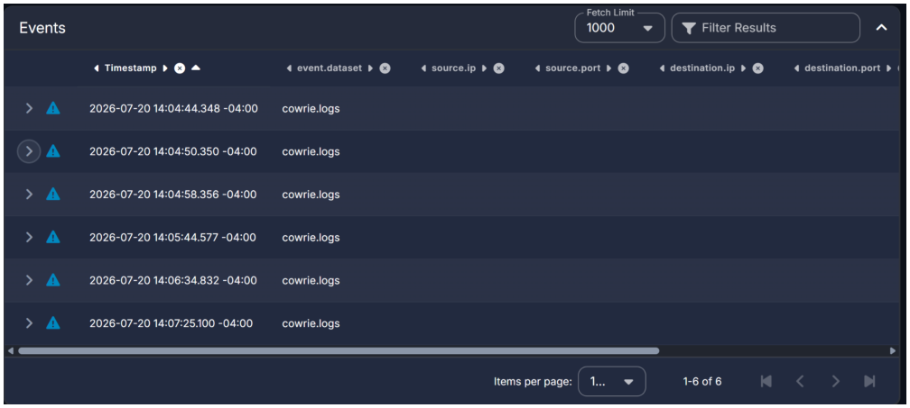

*Evidence 2 / Figure 2 - Six successful Cowrie logins*


## 4. From the Largest TTY File to the Source IP

The investigation began with the filesystem, not a known attacker address. The largest recording was replayed, its TTY input hash was searched in Hunt, and the expanded Cowrie event exposed both the session and source IP.

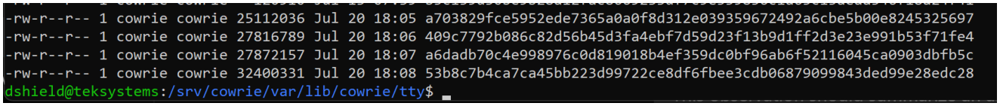

*Evidence 3 / Figure 3 - Largest TTY inventory*


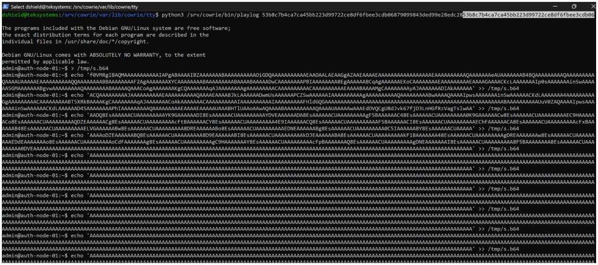

*Evidence 4 / Figure 4 - Largest TTY Base64 replay*


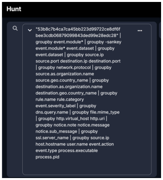

*Evidence 5 / Figure 5 - Hunt search using the TTY hash*


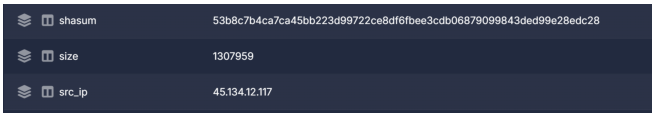

*Evidence 6 / Figure 6 - Expanded Cowrie source record*


## 5. Cross-Session Correlation and TTY Preservation

The source created six TTY recordings: four unusually large Base64 staging sessions, one readable Python proxy session, and one minimal connection. Session IDs, TTY paths, attacker-input hashes, and artifact hashes were used together for correlation.

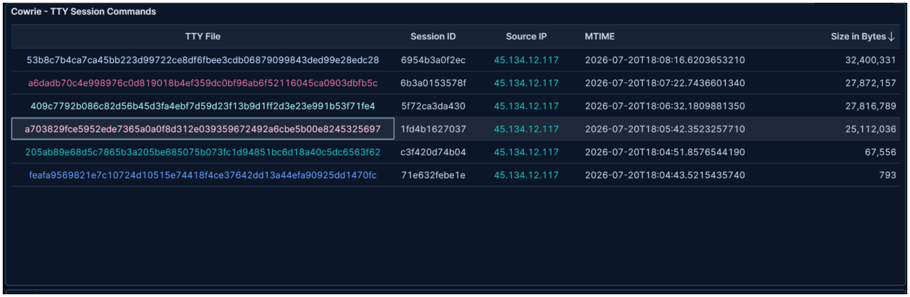

*Evidence 7 / Figure 7 - Cowrie TTY session table*


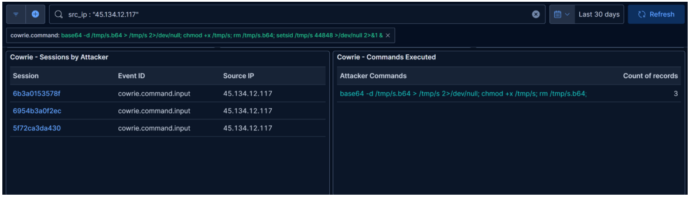

*Evidence 8 / Figure 8 - Decode and launch command filter*


## 6. Python SOCKS5 Script Creation

Session `c3f420d74b04` wrote `/tmp/s.py` using a heredoc and submitted a detached launch command. The program bound to `0.0.0.0:44848`, implemented SOCKS5 negotiation, parsed username/password authentication, opened client-selected TCP destinations, and relayed data in both directions.

The script embedded `root1234 / toor1234` but also accepted no-authentication negotiation under some conditions, creating the possibility of an open proxy.

<details>
    <summary>Click to expand code</summary>

    ```bash
    #!/usr/bin/env python3
    """Minimal SOCKS5 server. Single file, no deps. Port 44848, auth root1234:toor1234"""
    import socket, threading, os, sys, hashlib

    PORT = int(os.environ.get("SOCKS_PORT", 44848))
    USER = os.environ.get("SOCKS_USER", "root1234")
    PASS = os.environ.get("SOCKS_PASS", "toor1234")

    def handle_client(c):
        try:
            auth = c.recv(1024)
            if len(auth) < 3 or auth[0] != 5: c.close(); return
            nmethods = auth[1]
            methods = auth[2:2+nmethods]
            if 2 in methods:  # username/password
                c.sendall(b"\x05\x02")
                sub = c.recv(1024)
                if len(sub) < 5: c.close(); return
                ulen = sub[1]
                uname = sub[2:2+ulen].decode()
                plen = sub[2+ulen]
                pword = sub[3+ulen:3+ulen+plen].decode()
                if uname != USER or pword != PASS:
                    c.sendall(b"\x01\x01"); c.close(); return
                c.sendall(b"\x01\x00")
            elif 0 in methods:  # no auth
                c.sendall(b"\x05\x00")
            else:
                c.sendall(b"\x05\xff"); c.close(); return

            req = c.recv(1024)
            if len(req) < 10: c.close(); return
            atype = req[3]
            if atype == 1:  # IPv4
                dst = socket.inet_ntoa(req[4:8])
                dport = (req[8] << 8) | req[9]
            elif atype == 3:  # domain
                dlen = req[4]
                dst = req[5:5+dlen].decode()
                dport = (req[5+dlen] << 8) | req[6+dlen]
            else: c.close(); return

            try:
                remote = socket.socket(); remote.settimeout(30)
                remote.connect((dst, dport))
                c.sendall(b"\x05\x00\x00\x01" + socket.inet_aton("0.0.0.0") + b"\x00\x00")
                threading.Thread(target=lambda: pipe(c, remote), daemon=True).start()
                pipe(remote, c)
            except:
                try: c.sendall(b"\x05\x01\x00\x01" + socket.inet_aton("0.0.0.0") + b"\x00\x00")
                except: pass
        except: c.close()

    def pipe(a, b):
        try:
            while True:
                d = a.recv(4096)
                if not d: break
                b.sendall(d)
        except: pass
        try: a.close(); b.close()
        except: pass

    def main():
        s = socket.socket(); s.setsockopt(socket.SOL_SOCKET, socket.SO_REUSEADDR, 1)
        s.bind(("0.0.0.0", PORT)); s.listen(500)
        print(f"SOCKS5 on :{PORT} auth={USER}:{PASS}")
        while True:
            c, addr = s.accept()
            threading.Thread(target=handle_client, args=(c,), daemon=True).start()

    if __name__ == "__main__":
        main()

    EOF
    ```
</details>

*Attacker Bash script with Python3 code*

## 7. Why the Python Code Is a SOCKS5 Listener

| Code behavior | Meaning |
|---|---|
| `bind(("0.0.0.0", PORT))` | Listen on all IPv4 interfaces. |
| `listen()` and `accept()` | Accept inbound proxy clients. |
| SOCKS version `5` checks | SOCKS5 negotiation. |
| Username/password parsing | RFC 1929-style authentication. |
| IPv4/domain address parsing | Client-selected destination support. |
| `remote.connect((dst, dport))` | Open the outbound side of the proxy. |
| Bidirectional pipe functions | Relay bytes between client and destination. |

## 8. Base64 ELF Delivery and Launch Sequence

The native payloads were not compiled on the honeypot. Precompiled ELF bytes were transmitted as Base64 text, appended to `/tmp/s.b64`, decoded to `/tmp/s`, marked executable, and submitted to `setsid` with port `44848`.


*Evidence 9 / Figure 9 - Base64 ELF delivery*


## 9. Encoded Artifact and ELF Recovery

The ASCII streams began with `f0VMRg`, the Base64 representation of ELF magic `7f 45 4c 46`. Local decoding created valid native executables without running them.

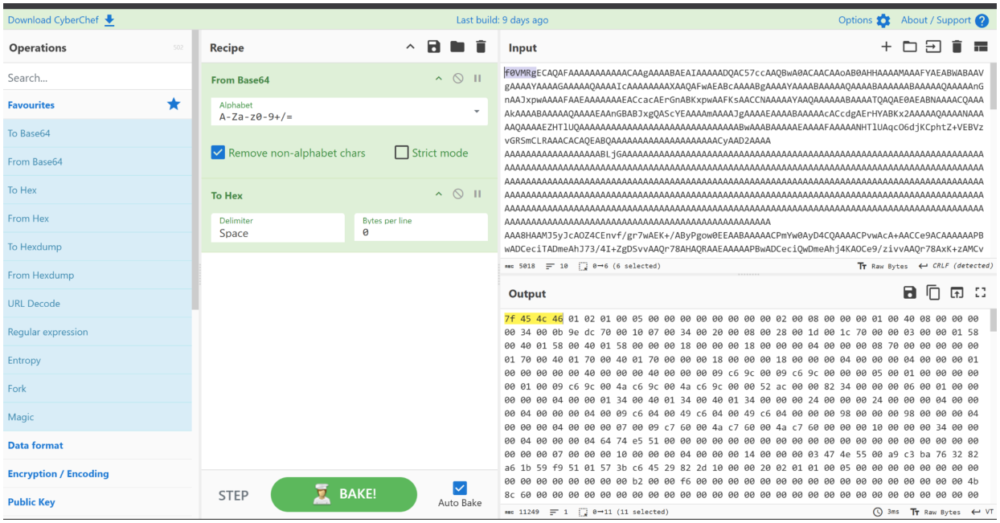

*Evidence 10 / Figure 10 - CyberChef ELF decoding*


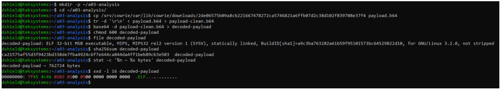

*Evidence 11 / Figure 11 - Local static decoding*


## 10. Encoded-to-ELF Artifact Mapping

All four encoded streams decoded cleanly into native Linux ELF files. Three decoded hashes exactly matched separately preserved Cowrie ELF objects; the ARM stream produced a valid ELF but did not appear as a separate dashboard object under its decoded hash.

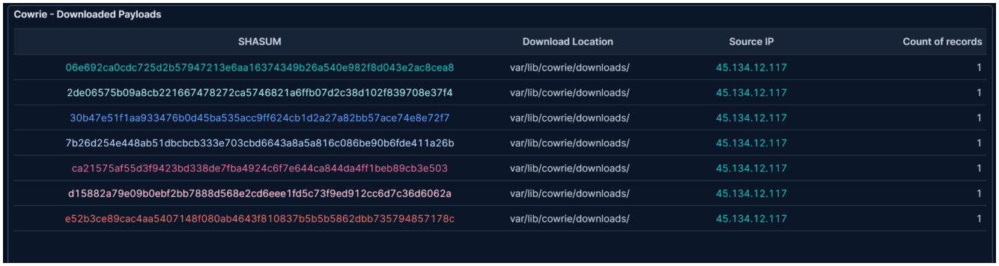

*Evidence 12 / Figure 12 - Cowrie payload inventory*


## 11. Architecture Coverage and File Classification

The recovered files covered x86-64, MIPS big-endian, MIPS little-endian, and ARM EABI5. This coverage is consistent with tooling intended for heterogeneous Linux/IoT environments.

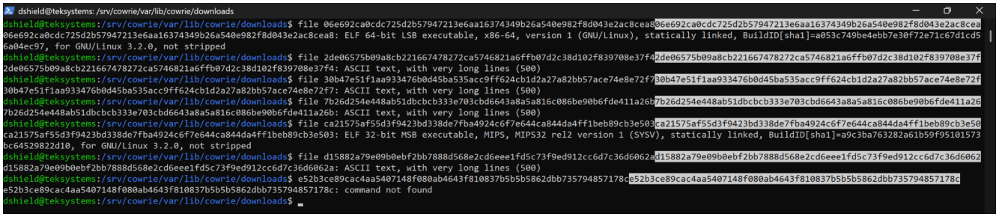

*Evidence 13 / Figure 13 - Architecture classification*


## 12. Static Analysis: Explicit SOCKS5 Indicators

Strings extracted from the decoded MIPS build included SOCKS5 text, proxy credentials, port information, and the source filename `microsocks.c`. These strings independently supported the proxy classification.

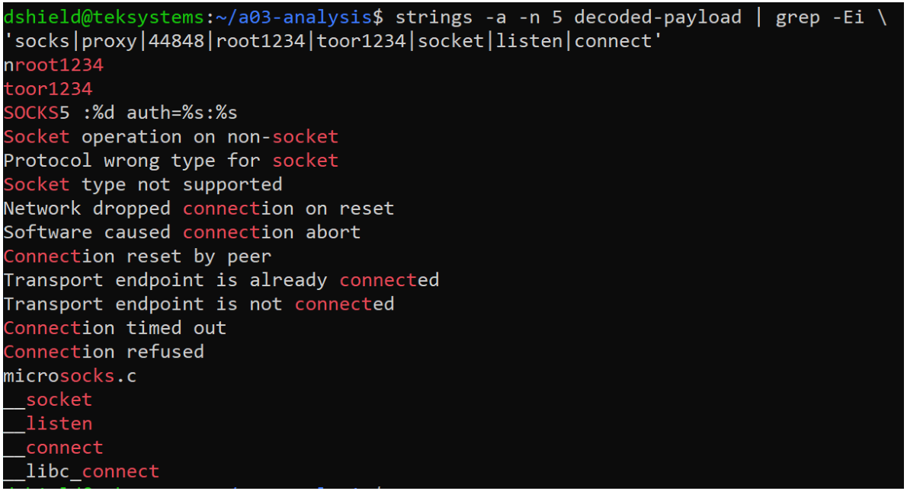

*Evidence 14 / Figure 14 - SOCKS5 strings*


## 13. Static Analysis: Server and Proxy Functions

Symbol and ELF metadata showed functions associated with server-side and outbound networking, including socket creation, bind, listen, accept, connect, and bidirectional relay behavior.

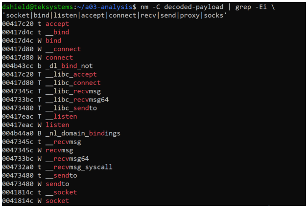

*Evidence 15 / Figure 15 - nm networking symbols*


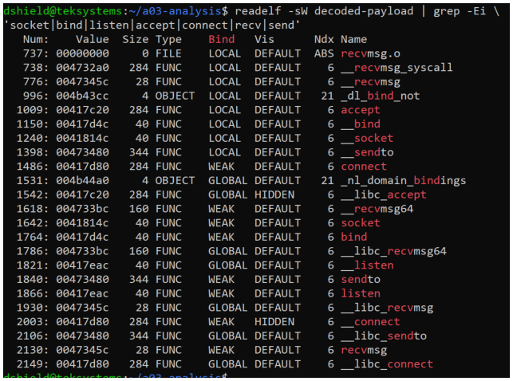

*Evidence 16 / Figure 16 - readelf networking symbols*


## 14. External Reputation and Infrastructure Context

DShield enrichment was treated as supplementary context rather than attribution. GeoIP, ASN, hostname, and reputation fields do not establish the operator's identity or physical location.

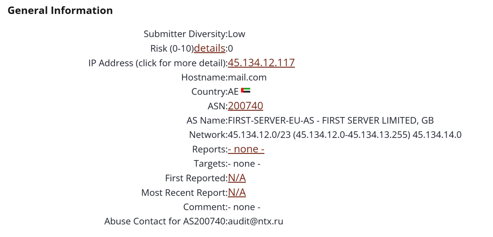

*Evidence 17 / Figure 17 - DShield infrastructure context*


## 15. Attack Chain and MITRE ATT&CK Mapping

| Stage | Observed activity | Outcome |
|---|---|---|
| Initial access | Six SSH logins using `admin / admin`. | Simulated shell access. |
| Payload staging | Python heredoc and Base64 echo commands. | Two delivery methods for the same proxy capability. |
| Decode/preparation | `base64 -d` and `chmod +x`. | Native ELF reconstruction attempted. |
| Execution | `setsid python3 /tmp/s.py` and `setsid /tmp/s 44848`. | Detached launch attempted. |
| Proxy objective | SOCKS5 code and four native builds. | Traffic-relay intent established. |
| Cleanup | Removal of `/tmp/s.b64`. | Cleanup intent observed. |

| Technique | ID | Basis |
|---|---|---|
| External Remote Services | T1133 | Internet-facing SSH used for access. |
| Valid Accounts: Default Accounts | T1078.001 | `admin / admin` accepted in six sessions. |
| Unix Shell | T1059.004 | Shell staging and launch commands. |
| Python | T1059.006 | Python SOCKS5 server created. |
| Encrypted/Encoded File | T1027.013 | ELF files transferred as Base64 text. |
| Ingress Tool Transfer | T1105 | Payload bytes transferred through the shell. |
| Proxy | T1090 | SOCKS5 listener/relay capability. |
| File Deletion | T1070.004 | Encoded staging file removed. |

## 16. Indicators and Detection Opportunities

- Detect repeated successful logins with default-style credentials.
- Detect long Base64 shell input and repeated append operations to temporary files.
- Alert on `base64 -d`, `chmod +x`, `setsid`, and execution from temporary paths.
- Detect unauthorized high-port listeners and processes that both accept and create connections.
- Correlate Cowrie TTY hashes, session IDs, commands, and decoded file hashes.

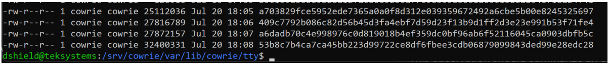

*Evidence 18 / Figure 18 - Original TTY inventory*


## 17. Assessment, Limitations, and Conclusion

The source authenticated six times, created a Python SOCKS5 implementation, transferred four Base64-encoded native builds, and attempted detached execution on TCP/44848. Cowrie proves submitted commands and deployment intent, but it does not prove a real listener opened, external clients connected, traffic was relayed, or the underlying Ubuntu/Proxmox host was compromised.

### Full artifact hash appendix

| Role | SHA-256 | Type / relationship |
|---|---|---|
| Encoded 1 | `2de06575b09a8cb221667478272ca5746821a6ffb07d2c38d102f839708e37f4` | Decodes to MIPS big-endian ELF. |
| ELF 1 | `ca21575af55d3f9423bd338de7fba4924c6f7e644ca844da4ff1beb89cb3e503` | MIPS32 big-endian SOCKS5 proxy. |
| Encoded 2 | `30b47e51f1aa933476b0d45ba535acc9ff624cb1d2a27a82bb57ace74e8e72f7` | Decodes to MIPS little-endian ELF. |
| ELF 2 | `e52b3ce89cac4aa5407148f080ab4643f810837b5b5b5862dbb735794857178c` | MIPS32 little-endian SOCKS5 proxy. |
| Encoded 3 | `7b26d254e448ab51dbcbcb333e703cbd6643a8a5a816c086be90b6fde411a26b` | Decodes to x86-64 ELF. |
| ELF 3 | `06e692ca0cdc725d2b57947213e6aa16374349b26a540e982f8d043e2ac8cea8` | x86-64 SOCKS5 proxy. |
| Encoded 4 | `d15882a79e09b0ebf2bb7888d568e2cd6eee1fd5c73f9ed912cc6d7c36d6062a` | Decodes to ARM ELF. |
| ELF 4 | `2bca8fb0dcb639687e6109674cf1d912499044194d0c35d86854be2b3df2ea32` | ARM EABI5 SOCKS5 proxy. |
| Largest TTY | `53b8c7b4ca7ca45bb223d99722ce8df6fbee3cdb06879099843ded99e28edc28` | Attacker-input hash and original Hunt pivot. |

### Selected references

1. Cowrie Project documentation and Output Event Code Reference.
2. IETF RFC 1928, SOCKS Protocol Version 5.
3. MITRE ATT&CK techniques T1133, T1078.001, T1059.004, T1059.006, T1027.013, T1105, T1090, and T1070.004.
4. MicroSocks project source and documentation.
5. SANS ISC/DShield IP information snapshot for `45.134.12.117`.
