# Attack Observation 4: Automated Mirai Malware Loader Attempt

## Report metadata

| Field | Value |
|---|---|
| Observation dates | 21-22 July 2026 |
| Observed source | `91.92.47.37` |
| Payload server | `91.92.42.213` |
| Honeypot | DShield Cowrie (`192.168.50.200`) |
| Initial services | SSH TCP/22 and Telnet TCP/23 |
| Accepted credential | `root / password` |
| First-stage loader | `hxxp://91[.]92[.]42[.]213/phantom.sh` |
| Confirmed loader size | 6,799 bytes |
| Final assessment | Credential-based access followed by an attempted Mirai-family multi-architecture deployment; final ELF execution and botnet enrollment were not confirmed. |

## 1. Executive Summary and Scope

The investigation began with a Suricata **ET TFTP Outbound TFTP Read Request** alert sourced from the internal honeypot. Because the sensor normally receives inbound SSH/Telnet attacks, the outbound TFTP request suggested that an authenticated session had instructed Cowrie to retrieve a file.

A pivot to destination `91.92.42.213`, followed by a Cowrie filter and command-event expansion, revealed session `e795302b39b3` and original source `91.92.47.37`. Cowrie recorded successful `root / password` authentication on 21 July and again during follow-on activity on 22 July. The source performed shell and system discovery and retrieved `phantom.sh`, a 6,799-byte multi-architecture loader.

| Metric | Observed value |
|---|---:|
| Outbound TFTP alerts | 12 |
| Successful Cowrie logins | 2 |
| Confirmed loader size | 6,799 bytes |
| Targeted architectures | 10 |

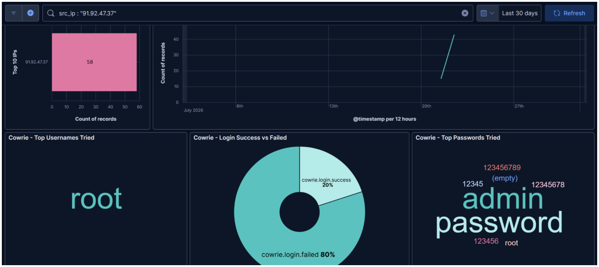

*Evidence 1 / Figure 1 - Cowrie source dashboard*

## Attack Selection and Targeted Exposure

The initial alert was unusual because it showed the honeypot sending TFTP read requests outward. That made it a strong lead for post-authentication behavior. The investigation produced two successful sessions, a complete TTY replay, a preserved loader, and cross-dataset evidence.

No named software vulnerability or CVE was observed. The source obtained Cowrie shell access by authenticating to exposed SSH/Telnet services with the common credential `root / password`.

## Attacker Objective

1. Authenticate as root.
2. Test the shell and query `/proc` and system information.
3. Retrieve `phantom.sh` using HTTP, FTP, or TFTP.
4. Try ten CPU-specific binaries.
5. Rename, execute, and delete staged files.

## Defensive Measures

| Priority | Control | Purpose |
|---|---|---|
| 1 | Disable Telnet and restrict SSH to VPN or allowlisted management networks. | Removes broad scanning and credential guessing. |
| 2 | Use unique passwords, SSH keys, MFA, and disable direct root password login. | Prevents common credentials from producing shell access. |
| 3 | Block unnecessary FTP/TFTP and restrict outbound HTTP to raw IP addresses. | Disrupts loader and binary retrieval. |
| 4 | Place IoT and management systems in restricted VLANs. | Limits impact if a device is compromised. |
| 5 | Correlate login success with wget/curl/tftp, chmod, executable creation, and cleanup. | Detects the complete loader sequence. |

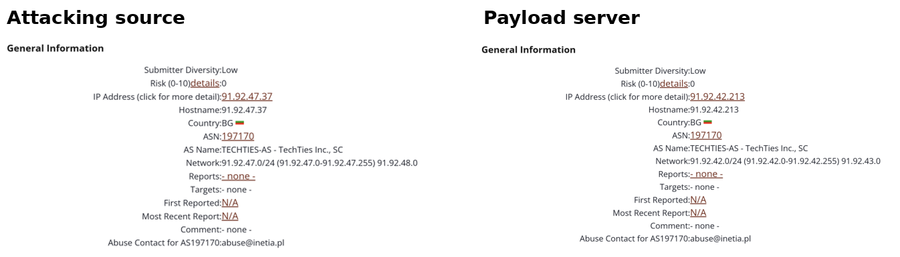

*Evidence 2 / Figure 2 - Source and payload-server DShield context*

## 2. Correlated Timeline

| UTC | Telemetry | Observed event |
|---|---|---|
| 18 Jul 15:49:03.195 | Zeek conn | Earlier TCP/23 probe from `91.92.47.37`. |
| 21 Jul 10:44:01.609 | Zeek conn | Earlier TCP/22 probe from the same source. |
| 21 Jul 23:03:16.150 | Zeek conn | SSH flow to the honeypot. |
| 21 Jul 23:04:48.856 | Cowrie login | `root / password` succeeded; session `e795302b39b3`. |
| 21 Jul ~23:05 | Cowrie command / HTTP | Command referenced `91.92.42.213`; `phantom.sh` was retrieved and preserved. |
| 21 Jul 23:05:08 | HTTP response | `200 OK`; `application/x-sh`; Content-Length 6,799. |
| 22 Jul 20:33:24.271 | Zeek conn | Telnet activity from the same source. |
| 22 Jul 20:33:37.444 | Cowrie login | `root / password` succeeded; session `fd29ec61c883`. |
| 22 Jul 20:33:42-43 | TTY replay | Wget and curl retrieved the loader; FTP/TFTP alternatives followed. |
| 22 Jul 20:34:18 | Cowrie TTY | TTY session closed; 26,255-byte replay preserved. |

## 3. Initial Access and Authentication Evidence

The July 21 successful session aligned with SSH TCP/22 and Cowrie TCP/2222. The July 22 login occurred during a burst of Telnet TCP/23 connections and Cowrie TCP/2223 activity.

*Evidence 3 / Figure 3 - Authentication dashboard*

## 4. From the TFTP Alert to the Original Source IP

The investigation moved from the outbound TFTP alert to payload server `91.92.42.213`, then to a Cowrie command event. Expanding that event exposed the loader command, session `e795302b39b3`, and source `91.92.47.37`.

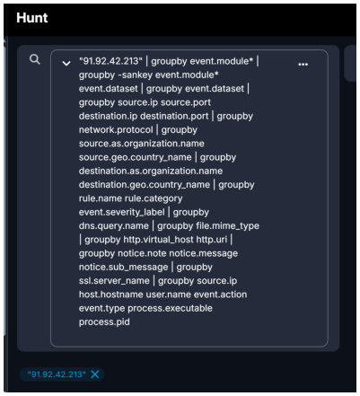

*Evidence 4 / Figure 4 - TFTP payload-IP search*

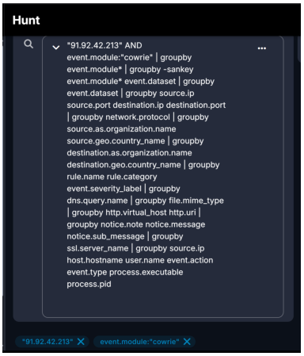

*Evidence 5 / Figure 5 - Cowrie filter*

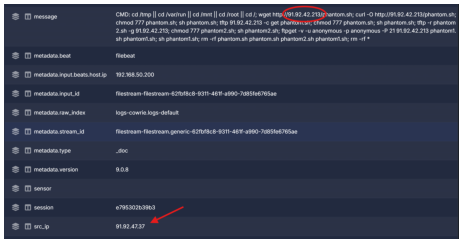

*Evidence 6 / Figure 6 - Expanded command/source record*

## 5. Cross-Dataset Session Correlation and TTY Preservation

Hunt exposed Zeek, endpoint, Suricata, and Cowrie records across several days. Cowrie session IDs, source IPs, commands, and TTY files were used as the primary preservation anchors.

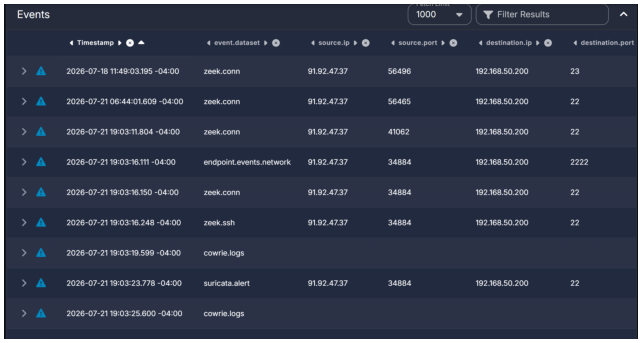

*Evidence 7 / Figure 7 - Cross-dataset Hunt results*

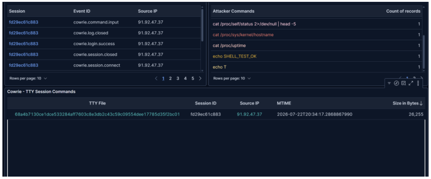

*Evidence 8 / Figure 8 - Cowrie session and TTY*

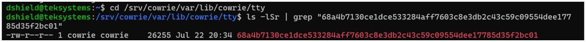

*Evidence 9 / Figure 9 - Local TTY verification*

## 6. Environment and System Discovery

The TTY replay included shell tests and queries for CPU information, MTD partitions, ARP data, uptime, BusyBox, hostname, `/etc/passwd`, and kernel details. These commands supported platform and environment decision logic before payload deployment.

## 7. Loader Command and Cleanup Behavior

A single chained command searched for a writable directory, tried several transfer utilities, executed the first-stage script, and removed evidence. The redundancy increased the chance of success across heterogeneous Linux and embedded systems.

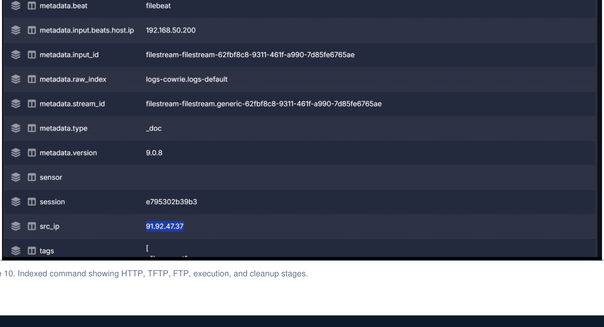

*Evidence 10 / Figure 10 - Indexed loader command*

## 8. Confirmed HTTP Loader Retrieval

The HTTP transcript independently confirmed the first-stage transfer. Cowrie used `Wget/1.11.4` to request `/phantom.sh`; the server returned `200 OK` with a 6,799-byte Bash script and MIME type `application/x-sh`.

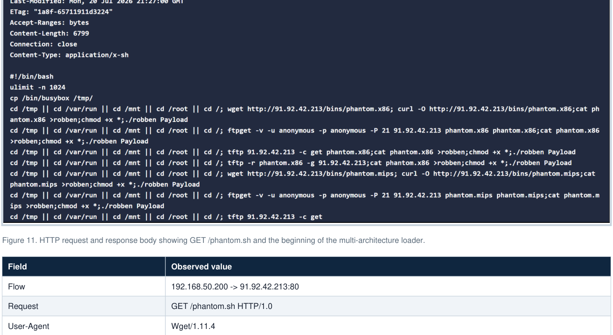

*Evidence 11 / Figure 11 - HTTP loader request and response*

## 9. Transfer Fallbacks and Outbound Activity

The command attempted HTTP, FTP, and TFTP. The 12 TFTP alerts reflected repeated retrieval attempts rather than 12 independent compromises. Multiple protocols increased resilience when one utility or network path was unavailable.

## 10. Multi-Architecture Loader Analysis

The recovered `phantom.sh` was a Bash loader, not the final bot executable. It repeated a download-copy-execute sequence for ten Linux and embedded processor targets and used the output name `robben` with the argument `Payload`.

*Evidence 12 / Figure 12 - Local loader identification*

## 11. Cowrie Artifact Inventory

The dashboard listed two unique SHA-256 values. Local inspection showed that only the 6,799-byte object was the malicious loader; the second object was Cowrie-generated command/redirection text and should not be counted as another malware sample.

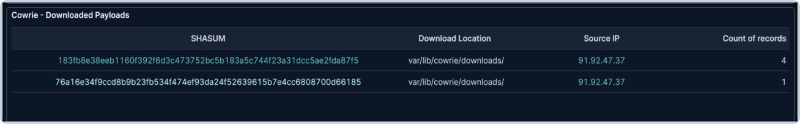

*Evidence 13 / Figure 13 - Cowrie artifact inventory*

## 12. Local Artifact Validation

Static inspection was performed without executing either artifact. The loader was identified as a Bourne-Again shell script and matched the HTTP response body.

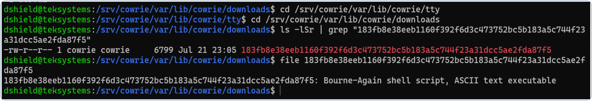

*Evidence 14 / Figure 14 - Loader file identification*

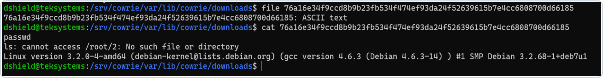

*Evidence 15 / Figure 15 - Non-malware Cowrie text artifact*

## 13. Threat-Intelligence Correlation

External intelligence associated the exact loader URL and architecture-specific paths with Mirai-family distribution infrastructure. This strengthened the family-level assessment, while the local evidence remained the basis for confirming the session, transfer, and deployment attempt.

## 14. Infrastructure Relationship and Reputation Context

The source and payload server served different roles but shared hosting context. DShield placed both addresses in Bulgaria under AS197170 (TechTies Inc.). Shared ASN ownership and GeoIP data do not establish common control, operator identity, physical location, or provider involvement.

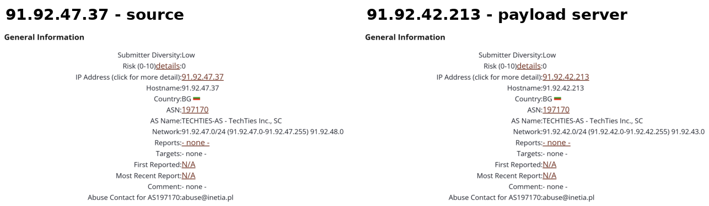

*Evidence 16 / Figure 16 - Infrastructure and reputation context*

## 15. Attack Chain and MITRE ATT&CK Mapping

| Stage | Observed activity | Outcome |
|---|---|---|
| Initial access | SSH and Telnet activity; `root / password` accepted twice. | Simulated shell access through weak/common credentials. |
| Execution/discovery | Shell tests and system queries. | Attacker decision logic confirmed. |
| Ingress transfer | Wget/Curl retrieval with FTP/TFTP fallbacks. | HTTP confirmed; alternatives attempted. |
| Payload deployment | Ten architecture-specific binaries copied to `robben` and launched with `Payload`. | Deployment intent confirmed; final ELF execution not observed. |
| Cleanup | `rm -rf` of loader names and wildcard cleanup. | Cleanup intent observed. |

| Technique | ID | Basis |
|---|---|---|
| Password Guessing | T1110.001 | Repeated common-password attempts against root. |
| Valid Accounts | T1078 | `root / password` accepted in two sessions. |
| External Remote Services | T1133 | Internet-facing SSH and Telnet. |
| Unix Shell | T1059.004 | Chained shell utilities and script execution. |
| Ingress Tool Transfer | T1105 | Wget, curl, FTP, and TFTP attempts. |
| Web Protocols | T1071.001 | HTTP loader and binary transport. |
| System Information Discovery | T1082 | CPU, kernel, hostname, and uptime queries. |
| System Network Configuration Discovery | T1016 | `/proc/net/arp` query. |
| File and Directory Discovery | T1083 | Directory fallback chain and `/etc/passwd` check. |
| File Deletion | T1070.004 | Cleanup commands. |

## 16. Indicators and Detection Opportunities

| Type | Indicator |
|---|---|
| Source IP | `91.92.47.37` |
| Payload server | `91.92.42.213` |
| Credential | `root / password` |
| Sessions | `e795302b39b3`, `fd29ec61c883` |
| Loader URL | `hxxp://91[.]92[.]42[.]213/phantom.sh` |
| Loader SHA-256 | `183fb8e38eeb1160f392f6d3c473752bc5b183a5c744f23a31dcc5ae2fda87f5` |
| Reported C2 | `91.92.42.213:1312` |

Detection priorities include successful remote-shell authentication followed by outbound HTTP, Wget/Curl to raw IP addresses, unusual FTP/TFTP from embedded systems, architecture-name bursts, `cat FILE > robben`, `chmod +x`, `./robben Payload`, and correlated session/flow/file identifiers.

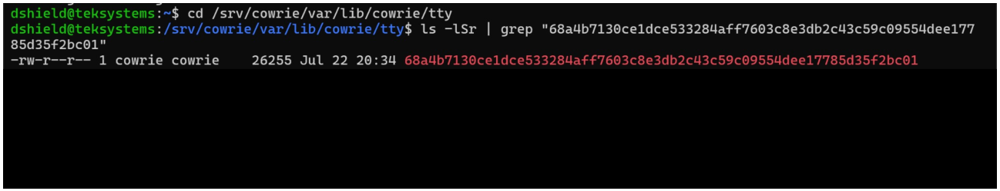

*Evidence 17 / Figure 17 - Preserved TTY file*

## 17. Assessment, Limitations, and Conclusion

Credential-based access to exposed SSH and Telnet services led to a confirmed first-stage loader transfer and attempted Mirai-family payload deployment. The evidence does not show compromise of the underlying Ubuntu/Debian or Proxmox host, successful execution of a final ELF, persistence, DDoS activity, or completed botnet enrollment.

### Selected references

1. Cowrie Project documentation and Output Event Code Reference.
2. URLhaus records for `phantom.sh` and `phantom.*` architecture paths.
3. MalwareBazaar report for the related payload hash cited in the report.
4. VirusTotal IP and file reports reviewed as supplementary context.
5. MITRE ATT&CK techniques T1110.001, T1078, T1133, T1059.004, T1105, T1071.001, T1082, T1016, T1083, and T1070.004.
